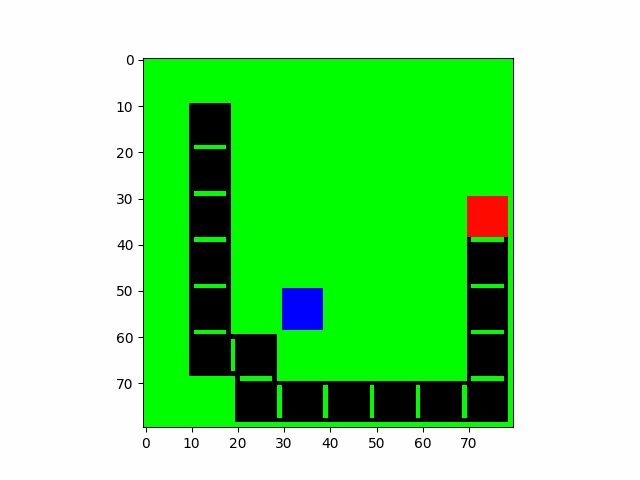
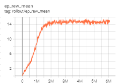

# Snake-RL-Agent 🐍

This project implements a Reinforcement Learning (RL) agent to play the classic game of Snake using [Stable Baselines](https://stable-baselines3.readthedocs.io/). 

 <!-- Replace with your actual media path -->

## Table of Contents

- [Snake-RL-Agent 🐍](#snake-rl-agent-)
  - [Table of Contents](#table-of-contents)
  - [Overview](#overview)
    - [Environment](#environment)
  - [Getting Started](#getting-started)
    - [Prerequisites](#prerequisites)
  - [Training the agent](#training-the-agent)
  - [Evaluation](#evaluation)
  - [Results](#results)
  - [Future Work](#future-work)

---

## Overview

The Snake game is a classic reinforcement learning environment that poses challenges like exploration, decision-making, and handling delayed rewards. Using Stable Baselines, this project trains a simple RL agent to play the game decently well.

### Environment

This project slightly modifies the [Gym-Snake](https://github.com/grantsrb/Gym-Snake) repository for training. Thanks to [grantsrb](https://github.com/grantsrb) for making it.

## Getting Started

### Prerequisites

- **Python** (>=3.7)
- **Stable Baselines 3**
- **Gymnasium**
- **Pytorch**
- **Numpy**
- **Matplotlib** (for plotting results)

1. First install all dependencies with:

```bash
pip install -r requirements.txt
```
2. Then pip install the Gym-Snake environment locally

```
pip install -e Gym-Snake
```

## Training the agent

To train the RL agent, run:

```bash
python train_agent.py
```


Training outputs will be saved to the agents folder


## Evaluation
Once trained, the model can be evaluated with:

```bash
python eval_agent.py
```
This script will visualize the Snake agent’s performance and compute evaluation metrics such as average score and survival time.


## Results

Learning Curve: Shows the agent’s reward over training episodes.


Gameplay GIF: A recording of the trained agent playing Snake.


## Future Work
- Explore Other Architectures: Experiment with algorithms such as SAC and TD3.
- Environment Modifications: Increase the Snake grid size or add obstacles for higher difficulty.
- Hyperparameter Tuning: Fine-tune training parameters for better performance.

